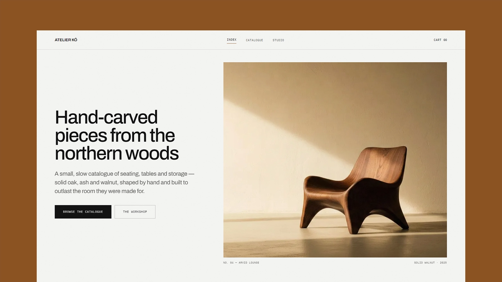

# Atelier Kō — Astro Furniture Store Theme

[](https://atelier-ko-topaz.vercel.app/)

[](https://astro.build/)
[](https://tailwindcss.com/)
[](https://www.typescriptlang.org/)
[](./LICENSE)

**Live preview:** https://atelier-ko-topaz.vercel.app/

Atelier Kō is an Astro theme for a small furniture workshop or any craft-led catalogue where the pieces are few and the photography does the selling. The design is cool and architectural: gallery-grey surfaces, Forum for headlines, labels, prices and dimensions, Figtree for running text, and a single oiled-walnut accent that picks up the timber in the photography. Structure is drawn with hairlines instead of cards and shadows — nothing is rounded, nothing floats, and no section is introduced by a caption above its headline. Motion is deliberate and quiet: sections rise as they enter, image frames unmask upward, section rules draw themselves left to right, and the hero drifts against the scroll. Content is Markdown validated by Astro content collections, the studio name, navigation, footer, contact and commerce defaults come from one config file, and the output is fully static — no framework runtime, and every enhancement degrades to working HTML.

## Features

- Editorial homepage: a split hero with the headline set against a drifting full-height photograph, a spec band, a numbered "in the workshop" grid, a full-width feature piece with its own spec table, and a three-timber panel
- Catalogue with client-side category and material filters, price sorting, a live result count, and an empty state when a combination matches nothing
- Static product pages with a thumbnail-switched gallery, a spec table, a quantity stepper, related pieces, and Product plus BreadcrumbList JSON-LD
- Slide-in cart drawer that opens on add, with per-line quantity steppers, a live subtotal, focus trap and Escape — driven entirely by two data attributes, and degrading to a plain link to the cart page without JavaScript
- LocalStorage cart with a full cart page, live order summary, and a two-step checkout preview with formatted card, expiry and CVC inputs
- Centred newsletter band in the footer, so it reaches every page instead of occupying a homepage section
- Studio page with a full-bleed workshop photograph, numbered principles, a pull-quote, and a statistics band
- Scroll motion built on one IntersectionObserver and four reveal variants — rise, fade, image unmask, and self-drawing rule — each element unobserved after it fires
- Scroll-driven CSS for the settling header and hero parallax, with no JavaScript at all where the browser supports `animation-timeline`, and a styled fallback where it does not
- Central theme config for studio name, navigation, footer columns, contact address, currency, delivery rate, and which products are promoted
- Self-hosted Figtree (variable) and Forum, latin and latin-ext only, four WOFF2 files totalling about 75 KB and nothing requested from a third-party origin
- Design tokens for every surface, text, accent and hairline colour, plus a small set of component classes for buttons, links, chips, fields and captions
- Astro image pipeline throughout: WebP, explicit dimensions, eager above the fold and lazy below
- Canonical URLs, Open Graph and Twitter cards with image dimensions, a configurable fallback share card, Organization, Product and BreadcrumbList JSON-LD, sitemap generation, and a dynamic `robots.txt`
- Accessible skip link, landmarks, one `h1` per page, real labels on every control, a focus-trapped mobile menu that restores focus on close, and visible focus rings
- Reduced motion and no-JavaScript both render every page complete and static
- Strict TypeScript, typed component props, and a Zod-validated content schema

## Tech Stack

- Astro 7
- Tailwind CSS 4 via the Vite plugin
- Vite 8
- TypeScript (strict)
- Astro content collections
- `@astrojs/sitemap`
- Sharp for image processing

## Requirements

- Node.js `22.12.0` or newer
- npm

## Getting Started

```bash
npm install
npm run dev
```

Build for production:

```bash
npm run build
```

Preview the production build locally:

```bash
npm run preview
```

## Deployment

The build is a plain static `dist/` directory, so any static host will serve it.

Set the canonical domain before building for production. Canonical URLs, Open Graph image URLs, the sitemap, `robots.txt`, and JSON-LD are all derived from it:

```bash
SITE=https://your-domain.com npm run build
```

The value is read by `site` in [astro.config.mjs](./astro.config.mjs), which falls back to the demo preview URL.

## Customization

Start with [src/config/site.ts](./src/config/site.ts) — studio name, tagline, default metadata, contact address, navigation, footer columns, currency, delivery rate, and the promoted products all live there.

See [CUSTOMIZATION.md](./CUSTOMIZATION.md) for the full guide: theme tokens and colour, typography, the component classes, motion and reveal variants, product frontmatter, catalogue filters, the cart and checkout, images, fonts, pages, and SEO.

## Content

Products live in [src/content/products](./src/content/products), in one folder per language (`fr/`, `en/`), with one Markdown file per piece. The filename becomes the URL slug, so `fr/chaise-arvid.md` is served at `/produits/chaise-arvid` and `en/chaise-arvid.md` at `/en/produits/chaise-arvid`. Frontmatter is validated by the schema in [src/content.config.ts](./src/content.config.ts), and categories and materials are derived from the files themselves rather than maintained in a second list.

Product images belong in [src/assets](./src/assets) so Astro can optimize them. Use `public/` only for files that must be served byte-for-byte.

Replace the demo catalogue, prices, photography, and studio copy before publishing. The newsletter and checkout flows are design previews and are not connected to any backend.

## Pages

French is the default language and is served from the root. The same routes exist in English under `/en/` (`/en/catalogue`). Paths are defined once in `routes` in [src/i18n/index.ts](./src/i18n/index.ts). See the Languages section of [CUSTOMIZATION.md](./CUSTOMIZATION.md).

| Route              | Page                                        |
| ------------------ | ------------------------------------------- |
| `/`                | Homepage                                    |
| `/catalogue`       | Full catalogue with filters and sorting     |
| `/produits/[slug]` | Product detail, generated per Markdown file |
| `/atelier`         | Studio story                                |
| `/panier`          | Cart and checkout preview (`noindex`)       |
| `/404`             | Not found (`noindex`)                       |

## Typography

The theme self-hosts two families and nothing else: [Forum](https://fonts.google.com/specimen/Forum) at 400 for headings, labels, buttons, prices and spec data, and [Figtree](https://fonts.google.com/specimen/Figtree) as a variable font for body copy. Both are split into latin and latin-ext subsets, four WOFF2 files in total, and both latin files are preloaded because they paint above the fold. See [Fonts](./CUSTOMIZATION.md#fonts) to swap or remove them.

## License

MIT. See [LICENSE](./LICENSE) for complete terms.
